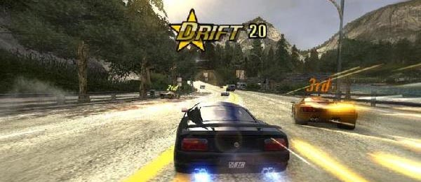

 
  
&nbsp;
 
 
 
<table border="1" cellpadding="0" cellspacing="0" bordercolor="#111111" id="AutoNumber2" class="style19" align="center"> 
  <tr> 
    <td height="19" style="border-bottom-style: solid; width: 67%;" align="center" class="style6" colspan="3"> 
    <strong>BRONZE</strong></td> 
  </tr> 
  <tr> 
    <td style="border-bottom-style: solid; height: 52px; width: 67%;" align="center" colspan="3" class="style18"> 
    These honourable mentions provided me with many hours of enjoyment.</td> 
  </tr> 
  <tr> 
    <td width="35%" style="border-bottom-style: solid; border-bottom-width: 1; height: 19px;" align="center" class="style24"> 
    NES</td> 
    <td width="33%" style="border-left-style: solid; border-left-width: 1; border-bottom-style: solid; border-bottom-width: 1; height: 19px;" align="center" class="style29"> 
    SNES</td> 
    <td width="32%" style="border-left-style: solid; border-left-width: 1; border-bottom-style: solid; border-bottom-width: 1; height: 19px;" align="center" class="style29"> 
    N64</td> 
  </tr> 
  <tr> 
    <td width="35%" height="19" style="border-left-style: solid; border-left-width: 1; border-bottom-style: none; border-bottom-width: medium" align="center" class="style22"> 
    Adventures of Lolo</td> 
    <td width="33%" height="19" align="center" class="style25"> 
    Donkey Kong Country 2: Diddy's Kong Quest</td> 
    <td width="32%" height="19" style="border-left-style: solid; border-left-width: 1; border-right-style: solid; border-right-width: 1; border-bottom-style: none; border-bottom-width: medium" align="center" class="style16"> 
    F-Zero X</td> 
  </tr> 
  <tr> 
    <td width="35%" height="19" style="border-left-style: solid; border-left-width: 1; border-top-style: none; border-top-width: medium; border-bottom-style: none; border-bottom-width: medium" align="center" class="style22"> 
    Dr. Mario</td> 
    <td width="33%" height="19" style="border-left-style: solid; border-left-width: 1; border-top-style: none; border-top-width: medium; border-bottom-style: none; border-bottom-width: medium" align="center" class="style16"> 
    F-Zero</td> 
    <td width="32%" height="19" style="border-left-style: solid; border-left-width: 1; border-right-style: solid; border-right-width: 1; border-top-style: none; border-top-width: medium; border-bottom-style: none; border-bottom-width: medium" align="center" class="style16"> 
    Rush 2: Extreme Racing</td> 
  </tr> 
  <tr> 
    <td width="35%" height="19" style="border-left-style: solid; border-left-width: 1; border-top-style: none; border-top-width: medium; border-bottom-style: none; border-bottom-width: medium" align="center" class="style22"> 
    Mega Man 2</td> 
    <td width="33%" height="19" style="border-left-style: solid; border-left-width: 1; border-top-style: none; border-top-width: medium; border-bottom-style: none; border-bottom-width: medium" align="center" class="style22"> 
    Illusion of Gaia</td> 
    <td width="32%" height="19" style="border-left-style: solid; border-left-width: 1; border-right-style: solid; border-right-width: 1; border-top-style: none; border-top-width: medium; border-bottom-style: none; border-bottom-width: medium" align="center" class="style22">
	&nbsp;</td> 
  </tr> 
  <tr> 
    <td width="35%" height="19" style="border-left-style: solid; border-left-width: 1; border-top-style: none; border-top-width: medium; border-bottom-style: none; border-bottom-width: medium" align="center" class="style22"> 
    Super Mario Bros. 2</td> 
    <td width="33%" height="19" style="border-left-style: solid; border-left-width: 1; border-top-style: none; border-top-width: medium; border-bottom-style: none; border-bottom-width: medium" align="center" class="style22"> 
    Mario Paint</td> 
    <td width="32%" height="19" style="border-left-style: solid; border-left-width: 1; border-right-style: solid; border-right-width: 1; border-top-style: none; border-top-width: medium; border-bottom-style: none; border-bottom-width: medium" align="center" class="style22">
	&nbsp;</td> 
  </tr> 
  <tr> 
    <td width="35%" height="19" style="border-left-style: solid; border-left-width: 1; border-top-style: none; border-top-width: medium; border-bottom-style: none; border-bottom-width: medium" align="center" class="style22"> 
    Teenage Mutant Ninja Turtles 2: The Arcade 
    Game</td> 
    <td width="33%" height="19" style="border-left-style: solid; border-left-width: 1; border-top-style: none; border-top-width: medium; border-bottom-style: none; border-bottom-width: medium" align="center" class="style22"> 
    Soul Blazer</td> 
    <td width="32%" height="19" style="border-left-style: solid; border-left-width: 1; border-right-style: solid; border-right-width: 1; border-top-style: none; border-top-width: medium; border-bottom-style: none; border-bottom-width: medium" align="center" class="style22">
	&nbsp;</td> 
  </tr> 
  <tr> 
    <td width="35%" height="19" style="border-left-style: solid; border-left-width: 1; border-top-style: none; border-top-width: medium; border-bottom-style: none; border-bottom-width: medium" align="center" class="style22"> 
    Zelda 2: The Adventure of Link</td> 
    <td width="33%" height="19" style="border-left-style: solid; border-left-width: 1; border-top-style: none; border-top-width: medium; border-bottom-style: none; border-bottom-width: medium" align="center" class="style22"> 
    Street Fighter II: The World Warrior</td> 
    <td width="32%" height="19" style="border-left-style: solid; border-left-width: 1; border-right-style: solid; border-right-width: 1; border-top-style: none; border-top-width: medium; border-bottom-style: none; border-bottom-width: medium" align="center" class="style22">
	&nbsp;</td> 
  </tr> 
  <tr> 
    <td width="35%" height="19" style="border-left-style: solid; border-left-width: 1; border-top-style: none; border-top-width: medium; border-bottom-style: none; border-bottom-width: medium" align="center" class="style22"> 
    &nbsp;</td> 
    <td width="33%" height="19" style="border-left-style: solid; border-left-width: 1; border-top-style: none; border-top-width: medium; border-bottom-style: none; border-bottom-width: medium" align="center" class="style22"> 
    Super Metroid</td> 
    <td width="32%" height="19" style="border-left-style: solid; border-left-width: 1; border-right-style: solid; border-right-width: 1; border-top-style: none; border-top-width: medium; border-bottom-style: none; border-bottom-width: medium" align="center" class="style22">
	&nbsp;</td> 
  </tr> 
  <tr> 
    <td width="35%" height="19" style="border-left-style: solid; border-left-width: 1; border-top-style: none; border-top-width: medium; border-bottom-style: solid; border-bottom-width: 1" align="center" class="style22"> 
    &nbsp;</td> 
    <td width="33%" height="19" align="center" class="style28"> 
    Top Gear 2</td> 
    <td width="32%" height="19" style="border-left-style: solid; border-left-width: 1; border-right-style: solid; border-right-width: 1; border-top-style: none; border-top-width: medium; border-bottom-style: solid; border-bottom-width: 1" align="center" class="style22">
	&nbsp;</td> 
  </tr> 
  <tr> 
    <td width="35%" height="19" style="border-left-style: none; border-left-width: medium; border-right-style: none; border-right-width: medium; border-bottom-style: solid; border-bottom-width: 1" align="center" class="style22">
	&nbsp;</td> 
    <td width="33%" height="19" style="border-left-style: none; border-left-width: medium; border-right-style: none; border-right-width: medium; border-bottom-style: solid; border-bottom-width: 1" align="center" class="style22">
	&nbsp;</td> 
    <td width="32%" height="19" style="border-left-style: none; border-left-width: medium; border-right-style: none; border-right-width: medium; border-bottom-style: solid; border-bottom-width: 1" align="center" class="style22">
	&nbsp;</td> 
  </tr> 
  <tr> 
    <td width="35%" height="19" style="border-bottom-style: solid; border-bottom-width: 1" align="center" class="style24"> 
    GB</td> 
    <td width="33%" height="19" style="border-left-style: solid; border-left-width: 1; border-bottom-style: solid; border-bottom-width: 1" align="center" class="style29"> 
    GBC</td> 
    <td width="32%" height="19" style="border-left-style: solid; border-left-width: 1; border-bottom-style: solid; border-bottom-width: 1" align="center" class="style29"> 
    GBA</td> 
  </tr> 
  <tr> 
    <td width="35%" height="19" style="border-left-style: solid; border-left-width: 1; border-bottom-style: none; border-bottom-width: medium" align="center" class="style22"> 
    Super Mario Land</td> 
    <td width="33%" height="19" style="border-left-style: solid; border-left-width: 1; border-bottom-style: none; border-bottom-width: medium" align="center" class="style16"> 
    Mario Tennis</td> 
    <td width="32%" height="19" style="border-left-style: solid; border-left-width: 1; border-right-style: solid; border-right-width: 1; border-bottom-style: none; border-bottom-width: medium" align="center" class="style16"> 
    ChuChu Rocket!</td> 
  </tr> 
  <tr> 
    <td width="35%" style="border-left-style: solid; border-left-width: 1; border-top-style: none; border-top-width: medium; border-bottom-style: none; border-bottom-width: medium; height: 19px;" align="center" class="style22"> 
    Super Mario Land 2: Six Golden Coins</td> 
    <td width="33%" style="border-left-style: solid; border-left-width: 1; border-top-style: none; border-top-width: medium; border-bottom-style: none; border-bottom-width: medium; height: 19px;" align="center" class="style16"> 
    The Legend of Zelda: Oracle of Ages</td> 
    <td width="32%" style="border-left-style: solid; border-left-width: 1; border-right-style: solid; border-right-width: 1; border-top-style: none; border-top-width: medium; border-bottom-style: none; border-bottom-width: medium; height: 19px;" align="center" class="style16"> 
    Final Fantasy Tactics Advance</td> 
  </tr> 
  <tr> 
    <td width="35%" height="19" style="border-left-style: solid; border-left-width: 1; border-top-style: none; border-top-width: medium; border-bottom-style: none; border-bottom-width: medium" align="center" class="style22"> 
    Super Mario Land 3: Wario Land</td> 
    <td width="33%" height="19" style="border-left-style: solid; border-left-width: 1; border-top-style: none; border-top-width: medium; border-bottom-style: none; border-bottom-width: medium" align="center"> 
    The Legend of Zelda: Oracle of Seasons&nbsp;</td> 
    <td width="32%" height="19" style="border-left-style: solid; border-left-width: 1; border-right-style: solid; border-right-width: 1; border-top-style: none; border-top-width: medium; border-bottom-style: none; border-bottom-width: medium" align="center" class="style22"> 
    Super Mario Bros. 2: Super Mario Advance</td> 
  </tr> 
  <tr> 
    <td width="35%" height="19" style="border-left-style: solid; border-left-width: 1; border-top-style: none; border-top-width: medium; border-bottom-style: none; border-bottom-width: medium" align="center" class="style22"> 
    Tetris</td> 
    <td width="33%" height="19" style="border-left-style: solid; border-left-width: 1; border-top-style: none; border-top-width: medium; border-bottom-style: none; border-bottom-width: medium" align="center" class="style22"> 
    &nbsp;</td> 
    <td width="32%" height="19" style="border-left-style: solid; border-left-width: 1; border-right-style: solid; border-right-width: 1; border-top-style: none; border-top-width: medium; border-bottom-style: none; border-bottom-width: medium" align="center" class="style22"> 
    Super Mario World: Super Mario Advance 2</td> 
  </tr> 
  <tr> 
    <td width="35%" height="19" style="border-left-style: solid; border-left-width: 1; border-top-style: none; border-top-width: medium; border-bottom-style: none; border-bottom-width: medium" align="center" class="style22"> 
    Yoshi</td> 
    <td width="33%" height="19" style="border-left-style: solid; border-left-width: 1; border-top-style: none; border-top-width: medium; border-bottom-style: none; border-bottom-width: medium" align="center" class="style22"> 
    &nbsp;</td> 
    <td width="32%" height="19" style="border-left-style: solid; border-left-width: 1; border-right-style: solid; border-right-width: 1; border-top-style: none; border-top-width: medium; border-bottom-style: none; border-bottom-width: medium" align="center" class="style22"> 
    Yoshi&#39;s Island: Super Mario Advance 3</td> 
  </tr> 
  <tr> 
    <td width="35%" height="19" style="border-left-style: solid; border-left-width: 1; border-top-style: none; border-top-width: medium; border-bottom-style: none; border-bottom-width: medium" align="center" class="style22"> 
    &nbsp;</td> 
    <td width="33%" height="19" style="border-left-style: solid; border-left-width: 1; border-top-style: none; border-top-width: medium; border-bottom-style: none; border-bottom-width: medium" align="center" class="style22">
	&nbsp;</td> 
    <td width="32%" height="19" style="border-left-style: solid; border-left-width: 1; border-right-style: solid; border-right-width: 1; border-top-style: none; border-top-width: medium; border-bottom-style: none; border-bottom-width: medium" align="center" class="style22">
	Super Mario Bros. 3: Super Mario Advance 4</td> 
  </tr> 
  <tr> 
    <td width="35%" height="19" style="border-left-style: solid; border-left-width: 1; border-top-style: none; border-top-width: medium; border-bottom-style: solid; border-bottom-width: 1" align="center" class="style22"> 
    &nbsp;</td> 
    <td width="33%" height="19" style="border-left-style: solid; border-left-width: 1; border-top-style: none; border-top-width: medium; border-bottom-style: solid; border-bottom-width: 1" align="center" class="style22">
	&nbsp;</td> 
    <td width="32%" height="19" style="border-left-style: solid; border-left-width: 1; border-right-style: solid; border-right-width: 1; border-top-style: none; border-top-width: medium; border-bottom-style: solid; border-bottom-width: 1" align="center" class="style22">
	WarioWare, Inc.: Mega Microgame$!</td> 
  </tr> 
  <tr> 
    <td width="35%" height="19" style="border-left-style: none; border-left-width: medium; border-right-style: none; border-right-width: medium; border-bottom-style: solid; border-bottom-width: 1" align="center" class="style22">
	&nbsp;</td> 
    <td width="33%" height="19" style="border-left-style: none; border-left-width: medium; border-right-style: none; border-right-width: medium; border-bottom-style: solid; border-bottom-width: 1" align="center" class="style22">
	&nbsp;</td> 
    <td width="32%" height="19" style="border-left-style: none; border-left-width: medium; border-right-style: none; border-right-width: medium; border-bottom-style: solid; border-bottom-width: 1" align="center" class="style22">
	&nbsp;</td> 
  </tr> 
  <tr> 
    <td width="35%" height="19" style="border-bottom-style: solid; border-bottom-width: 1" align="center" class="style24"> 
    PS1</td> 
    <td width="33%" height="19" style="border-left-style: solid; border-left-width: 1; border-right-style: solid; border-right-width: 1; border-bottom-style: solid; border-bottom-width: 1" align="center" class="style31"> 
    DS</td> 
    <td width="32%" height="19" style="border-bottom-style: solid; border-bottom-width: 1" align="center" class="style31"> 
    WII</td> 
  </tr> 
  <tr> 
    <td width="35%" height="19" style="border-left-style: solid; border-left-width: 1; border-bottom-style: none; border-bottom-width: medium" align="center" class="style22"> 
    Final Fantasy Tactics</td> 
    <td width="33%" height="19" style="border-left-style: solid; border-left-width: 1; border-right-style: solid; border-right-width: 1; border-bottom-style: none; border-bottom-width: medium" align="center" class="style22"> 
    Animal Crossing: Wild World</td> 
    <td width="32%" height="19" style="border-right-style: solid; border-right-width: 1; border-bottom-style: none; border-bottom-width: medium" align="center" class="style22"> 
    Kirby&#39;s Return to Dreamland</td> 
  </tr> 
  <tr>
    <td width="35%" height="19" style="border-left-style: solid; border-left-width: 1; border-top-style: none; border-top-width: medium; border-bottom-style: none; border-bottom-width: medium" align="center" class="style22"> 
    Intelligent Qube</td> 
    <td width="33%" height="19" style="border-left-style: solid; border-left-width: 1; border-top-style: none; border-top-width: medium; border-bottom-style: none; border-bottom-width: medium" align="center" class="style22"> 
    Phoenix Wright: Ace Attorney</td> 
    <td width="32%" height="19" style="border-left-style: solid; border-left-width: 1; border-right-style: solid; border-right-width: 1; border-top-style: none; border-top-width: medium; border-bottom-style: none; border-bottom-width: medium" align="center" class="style22"> 
    Super Paper Mario</td> 
  </tr>
  <tr> 
    <td width="35%" height="19" style="border-left-style: solid; border-left-width: 1; border-top-style: none; border-top-width: medium; border-bottom-style: solid; border-bottom-width: 1" align="center" class="style22"> 
    Parasite Eve</td> 
    <td width="33%" height="19" style="border-left-style: solid; border-left-width: 1; border-right-style: solid; border-right-width: 1; border-top-style: none; border-top-width: medium; border-bottom-style: solid; border-bottom-width: 1" align="center" class="style22"> 
    &nbsp;</td> 
    <td width="32%" height="19" style="border-right-style: solid; border-right-width: 1; border-top-style: none; border-top-width: medium; border-bottom-style: solid; border-bottom-width: 1" align="center" class="style22"> 
    Zack and Wiki: Quest for Barbaros&#39; Treasure</td> 
  </tr> 
  <tr>
    <td width="35%" height="19" style="border-left-style: none; border-left-width: medium; border-right-style: none; border-right-width: medium; border-bottom-style: solid; border-bottom-width: 1" align="center" class="style22">
	&nbsp;</td> 
    <td width="33%" height="19" style="border-left-style: none; border-left-width: medium; border-right-style: none; border-right-width: medium; border-bottom-style: solid; border-bottom-width: 1" align="center" class="style22">
	&nbsp;</td> 
    <td width="32%" height="19" style="border-left-style: none; border-left-width: medium; border-right-style: none; border-right-width: medium; border-bottom-style: solid; border-bottom-width: 1" align="center" class="style22">
	&nbsp;</td> 
  </tr>
	<tr>
    <td width="35%" height="19" style="border-bottom-style: solid; border-bottom-width: 1" align="center" class="style24"> 
    PS2</td> 
    <td width="33%" height="19" style="border-left-style: solid; border-left-width: 1; border-right-style: solid; border-right-width: 1; border-bottom-style: solid; border-bottom-width: 1" align="center" class="style24"> 
    NGC</td> 
    <td width="32%" height="19" style="border-bottom-style: solid; border-bottom-width: 1" align="center" class="style29"> 
    XBOX</td> 
  </tr>
	<tr>
    <td width="35%" height="19" style="border-left-style: solid; border-left-width: 1; border-bottom-style: none; border-bottom-width: medium" align="center" class="style22"> 
    Dragon Quest VIII: Journey of the Cursed King</td> 
    <td width="33%" height="19" style="border-left-style: solid; border-left-width: 1; border-right-style: solid; border-right-width: 1; border-bottom-style: none; border-bottom-width: medium" align="center" class="style22"> 
    Metroid Prime 2: Echoes</td> 
    <td width="32%" height="19" style="border-right-style: solid; border-right-width: 1; border-bottom-style: none; border-bottom-width: medium" align="center" class="style16"> 
    Dead or Alive 3</td> 
  </tr>
	<tr>
    <td width="35%" style="border-left-style: solid; border-left-width: 1; border-top-style: none; border-top-width: medium; border-bottom-style: none; border-bottom-width: medium; height: 19px;" align="center" class="style22"> 
    Final Fantasy XII</td> 
    <td width="33%" style="border-left-style: solid; border-left-width: 1; border-top-style: none; border-top-width: medium; border-bottom-style: none; border-bottom-width: medium; height: 19px;" align="center" class="style22"> 
    Viewtiful Joe</td> 
    <td width="32%" style="border-left-style: solid; border-left-width: 1; border-right-style: solid; border-right-width: 1; border-top-style: none; border-top-width: medium; border-bottom-style: none; border-bottom-width: medium; height: 19px;" align="center" class="style22"> 
    JSRF: Jet Set Radio Future</td> 
  </tr>
	<tr>
    <td width="35%" height="19" style="border-left-style: solid; border-left-width: 1; border-top-style: none; border-top-width: medium; border-bottom-style: none; border-bottom-width: medium" align="center" class="style22"> 
    God of War</td> 
    <td width="33%" height="19" style="border-left-style: solid; border-left-width: 1; border-top-style: none; border-top-width: medium; border-bottom-style: none; border-bottom-width: medium" align="center" class="style22"> 
    &nbsp;</td> 
    <td width="32%" height="19" style="border-left-style: solid; border-left-width: 1; border-right-style: solid; border-right-width: 1; border-top-style: none; border-top-width: medium; border-bottom-style: none; border-bottom-width: medium" align="center" class="style22"> 
    Prince of Persia: The Sands of Time</td> 
  </tr>
	<tr>
    <td width="35%" height="19" style="border-left-style: solid; border-left-width: 1; border-top-style: none; border-top-width: medium; border-bottom-style: none; border-bottom-width: medium" align="center" class="style22"> 
    Jak and Daxter: The Precursor Legacy</td> 
    <td width="33%" height="19" style="border-left-style: solid; border-left-width: 1; border-top-style: none; border-top-width: medium; border-bottom-style: none; border-bottom-width: medium" align="center" class="style22"> 
    &nbsp;</td> 
    <td width="32%" height="19" style="border-left-style: solid; border-left-width: 1; border-right-style: solid; border-right-width: 1; border-top-style: none; border-top-width: medium; border-bottom-style: none; border-bottom-width: medium" align="center" class="style22"> 
    &nbsp;</td> 
  </tr>
	<tr>
    <td width="35%" height="19" style="border-left-style: solid; border-left-width: 1; border-top-style: none; border-top-width: medium; border-bottom-style: none; border-bottom-width: medium" align="center" class="style22"> 
    The Simpsons: Hit and Run</td> 
    <td width="33%" height="19" style="border-left-style: solid; border-left-width: 1; border-top-style: none; border-top-width: medium; border-bottom-style: none; border-bottom-width: medium" align="center" class="style22">
	&nbsp;</td> 
    <td width="32%" height="19" style="border-left-style: solid; border-left-width: 1; border-right-style: solid; border-right-width: 1; border-top-style: none; border-top-width: medium; border-bottom-style: none; border-bottom-width: medium" align="center" class="style22">
	&nbsp;</td> 
  </tr>
	<tr>
    <td width="35%" height="19" style="border-left-style: solid; border-left-width: 1; border-top-style: none; border-top-width: medium; border-bottom-style: solid; border-bottom-width: 1" align="center" class="style22"> 
    Soul Calibur II</td> 
    <td width="33%" height="19" style="border-left-style: solid; border-left-width: 1; border-right-style: solid; border-right-width: 1; border-top-style: none; border-top-width: medium; border-bottom-style: solid; border-bottom-width: 1" align="center" class="style22"> 
    &nbsp;</td> 
    <td width="32%" height="19" style="border-right-style: solid; border-right-width: 1; border-top-style: none; border-top-width: medium; border-bottom-style: solid; border-bottom-width: 1" align="center" class="style22"> 
    &nbsp;</td> 
  </tr>
	<tr>
    <td width="35%" height="19" style="border-left-style: none; border-left-width: medium; border-right-style: none; border-right-width: medium" align="center" class="style22">
	&nbsp;</td> 
    <td width="33%" height="19" style="border-left-style: none; border-left-width: medium; border-right-style: none; border-right-width: medium" align="center" class="style22">
	&nbsp;</td> 
    <td width="32%" height="19" style="border-left-style: none; border-left-width: medium; border-right-style: none; border-right-width: medium" align="center" class="style22">
	&nbsp;</td> 
  </tr>
  <tr> 
    <td width="35%" height="20" style="border-left-style: solid; border-left-width: 1; border-right-style: none; border-right-width: medium; border-top-style: solid; border-top-width: 1; border-bottom-style: solid; border-bottom-width: 1" align="center" class="style32">
	&nbsp;</td> 
    <td width="33%" height="20" style="border-left-style: none; border-left-width: medium; border-right-style: none; border-right-width: medium; border-top-style: solid; border-top-width: 1; border-bottom-style: solid; border-bottom-width: 1" align="center" class="style29"> 
    PC</td> 
    <td width="32%" height="20" style="border-left-style: none; border-left-width: medium; border-right-style: solid; border-right-width: 1; border-top-style: solid; border-top-width: 1; border-bottom-style: solid; border-bottom-width: 1" align="center" class="style32">
	&nbsp;</td> 
  </tr> 
  <tr> 
    <td width="35%" height="20" style="border-left-style: solid; border-left-width: 1; border-bottom-style: none; border-bottom-width: medium" align="center" class="style22"> 
    Age of Empires</td> 
    <td width="33%" height="20" style="border-left-style: solid; border-left-width: 1; border-bottom-style: none; border-bottom-width: medium" align="center" class="style16"> 
    Prince of Persia</td> 
    <td width="32%" height="20" style="border-left-style: solid; border-left-width: 1; border-right-style: solid; border-right-width: 1; border-bottom-style: none; border-bottom-width: medium" align="center" class="style16"> 
    Worms</td> 
  </tr> 
  <tr> 
    <td width="35%" height="20" style="border-left-style: solid; border-left-width: 1; border-top-style: none; border-top-width: medium; border-bottom-style: none; border-bottom-width: medium" align="center" class="style22"> 
    Crysis</td> 
    <td width="33%" height="20" style="border-left-style: solid; border-left-width: 1; border-top-style: none; border-top-width: medium; border-bottom-style: none; border-bottom-width: medium" align="center" class="style16"> 
    RollerCoaster Tycoon</td> 
    <td width="32%" height="20" style="border-left-style: solid; border-left-width: 1; border-right-style: solid; border-right-width: 1; border-top-style: none; border-top-width: medium; border-bottom-style: none; border-bottom-width: medium" align="center" class="style16"> 
    Worms 2</td> 
  </tr> 
  <tr> 
    <td width="35%" style="border-left-style: solid; border-left-width: 1; border-top-style: none; border-top-width: medium; border-bottom-style: none; border-bottom-width: medium" align="center" class="style22"> 
    Doom</td> 
    <td width="33%" style="border-left-style: solid; border-left-width: 1; border-top-style: none; border-top-width: medium; border-bottom-style: none; border-bottom-width: medium" align="center" class="style16"> 
    The Sims</td> 
    <td width="32%" style="border-left-style: solid; border-left-width: 1; border-right-style: solid; border-right-width: 1; border-top-style: none; border-top-width: medium; border-bottom-style: none; border-bottom-width: medium" align="center" class="style16"> 
    Warcraft II: Tides of Darkness</td> 
  </tr> 
  <tr> 
    <td width="35%" height="19" style="border-left-style: solid; border-left-width: 1; border-top-style: none; border-top-width: medium; border-bottom-style: solid; border-bottom-width: 1" align="center" class="style22"> 
    NHL 2002</td> 
    <td width="33%" height="19" style="border-left-style: solid; border-left-width: 1; border-top-style: none; border-top-width: medium; border-bottom-style: solid; border-bottom-width: 1" align="center" class="style16"> 
    Simtower</td> 
    <td width="32%" height="19" style="border-left-style: solid; border-left-width: 1; border-right-style: solid; border-right-width: 1; border-top-style: none; border-top-width: medium; border-bottom-style: solid; border-bottom-width: 1" align="center" class="style16"> 
    Warcraft III: Reign of Chaos</td> 
  </tr> 
</table> 
 
 

&nbsp;

&nbsp;

 
 
<table style="width: 1280px" align="center">
	<tr>
    <td height="19" style="width: 67%;" align="center" class="style8" colspan="2"> 
    <strong>SILVER</strong></td> 
  	</tr>
	<tr>
    <td width="50%" align="center" colspan="2" style="width: 100%; height: 52px" class="style17"> 
    Presented in no particular order, these are some of my absolute favourites 
	that fall just outside of my top five.</td> 
  	</tr>
	<tr>
    <td width="50%" height="300" align="center" class="style20"> 
    </td> 
    <td width="50%" height="300" align="center"> 
	

	<strong>Super Mario 64 
	</strong>Nintendo 64

	

	Genre: Platformer

	

	Release: September 1996

	

	<strong><u>Summary 
	</u></strong>This game is revolutionary. Mario&#39;s 
	transition into 3D was smooth and graceful, and he brought with him a ton of 
	new gameplay mechanics never seen before. Everything introduced 
	raised the bar several notches, and <em>Super Mario 64</em> still 
	stands as one of the greatest games ever.

	</td> 
  	</tr>
	<tr>
    <td width="50%" height="300" align="center"> 
	

	<strong>Skies of Arcadia Legends 
	</strong>Nintendo GameCube

	

	Genre: RPG

	

	Release: January 2003

	

	<strong><u>Summary 
	</u></strong>This is definitely one of the most enjoyable games 
	out there. The difference between this and some other titles in its genre is 
	its ability to remain light-hearted, optimistic, friendly, and charming 
	while still being a ton of fun. I&#39;d recommend this or its Dreamcast 
	equivalent any day.

	</td> 
    <td width="50%" height="300" align="center" class="style20"> 
    </td> 
  	</tr>
	<tr>
    <td width="50%" height="300" align="center" class="style20"> 
    </td> 
    <td width="50%" height="300" align="center"> 
	

	<strong>Super Mario Galaxy 2 
	</strong>Nintendo Wii

	

	Genre: Platformer

	

	Release: May 2010

	

	<strong><u>Summary 
	</u></strong>While just as amazing as its predecessor, 
	the reason this isn&#39;t in the top 5 is because it wasn&#39;t the jaw-dropping 
	genre-redefining experience that <em>Super Mario Galaxy </em>was.<em> </em>
	Still, it offers up new power-ups and many fantastic challenges, and is definitely 
	up there as one of the best.

		</td> 
  	</tr>
	<tr>
    <td width="50%" height="300" align="center"> 
	

	<strong>Valkyrie Profile 
	</strong>Sony PlayStation

	

	Genre: RPG

	

	Release: August 2000

	

	<strong><u>Summary 
	</u></strong>A fantastic tale of Norse Mythology, <em>
	Valkyrie Profile</em> is absolutely incredible. I&#39;ve never felt so moved by 
	a story, conveyed wonderfully through lighting, tone, atmosphere, and superb voice 
	acting. The gameplay itself is also well executed, although a bit 
	complicated.

		</td> 
    <td width="50%" height="300" align="center" class="style20"> 
    </td> 
  	</tr>
	<tr>
    <td width="50%" height="300" align="center" class="style20"> 
    </td> 
    <td width="50%" height="300" align="center"> 
	

	<strong>Metroid Fusion 
	</strong>Game Boy Advance

	

	Genre: Platformer

	

	Release: November 2002

	

	<strong><u>Summary 
	</u></strong>This is a well crafted Metroid game, and 
	works very well despite the smaller real estate to work with. The controls 
	are solid, the graphics are crisp, and the gameplay is in keeping 
	with the series as a whole. It&#39;s far more linear than the rest of the 
	series, but it&#39;s still a worthy addition.

		</td> 
  	</tr>
	<tr>
    <td width="50%" height="300" align="center"> 
	

	<strong>Mario Kart DS 
	</strong>Nintendo DS

	

	Genre: Racing

	

	Release: November 2005

	

	<strong><u>Summary 
	</u></strong>I love this game. I&#39;ve put countless 
	hours into it, mostly online. I don&#39;t really play games online, but 
	this one is the exception. I find the controls so fluid and well 
	implemented, the track designs so fun, and the challenge in mastering 
	advanced techniques very rewarding.

		</td> 
    <td width="50%" height="300" align="center" class="style20"> 
    </td> 
  	</tr>
	<tr>
    <td width="50%" height="300" align="center" class="style20"> 
    </td> 
    <td width="50%" height="300" align="center"> 
	

	<strong>Chrono Trigger 
	</strong>Super Nintendo

	

	Genre: RPG

	

	Release: August 1995

	

	<strong><u>Summary 
	</u></strong>Chrono Trigger was one of the SNES&#39;s last 
	major entries, but also one of the strongest RPGs of its time. Through a 
	host of interesting characters, the game tells its tale in a way 
	that keeps players engaged, while also employing mechanics that seem simple 
	yet are so finely tuned.

		</td> 
  	</tr>
	<tr>
    <td width="50%" height="300" align="center"> 
	

	<strong>Max Payne 
	</strong>Windows

	

	Genre: Action

	

	Release: July 2001

	

	<strong><u>Summary 
	</u></strong>Max Payne is a lot of fun. It offers up 
	an atmosphere not previously seen in its genre, through compelling 
	storytelling and a unique narrative. The introduction of the &#39;bullet time&#39; 
	technique clearly sets the bar for later games, and aids it overall in being exciting and fast-paced.

		</td> 
    <td width="50%" height="300" align="center" class="style20"> 
    </td> 
  	</tr>
	<tr>
    <td width="50%" height="300" align="center" class="style20"> 
    </td> 
    <td width="50%" height="300" align="center"> 
	

	<strong>Super Mario Bros. 
	</strong>Nintendo

	

	Genre: Platformer

	

	Release: October 1985

	

	<strong><u>Summary 
	</u></strong>As the game that started it all, it still stands up as one of the absolute best of its genre. 
	The music is legendary and the controls are simple but work so well. It&#39;s a 
	title that changed the face of the gaming industry forever. Few games will 
	go down in history with the same impact.

		</td> 
  	</tr>
	<tr>
    <td width="50%" height="300" align="center"> 
	

	<strong>Chrono Cross 
	</strong>Sony PlayStation

	

	Genre: RPG

	

	Release: August 2000

	

	<strong><u>Summary 
	</u></strong>Chrono Cross is a very well done title, although 
	unusual in its genre. So many playable characters. A lot of strategy involved 
	with various elemental combinations. A complicated story that sometimes gets 
	very dark, but overall, a real pleasure to play.

		</td> 
    <td width="50%" height="300" align="center" class="style20"> 
    </td> 
  	</tr>
	<tr>
    <td width="50%" height="300" align="center" class="style20"> 
    </td> 
    <td width="50%" height="300" align="center"> 
	

	<strong>Super Mario Bros. 3 
	</strong>Nintendo

	

	Genre: Platformer

	

	Release: February 1990

	

	<strong><u>Summary 
	</u></strong>What an amazing game. I loved the 
	original, am fond of the second title, but SMB3 takes it to a whole new 
	level. The execution is so perfect that it still holds up well over 25 years later. With beautiful music, lots of new 
	power-ups, and a lot of heart - this game rocks. 

		</td> 
  	</tr>
	<tr>
    <td width="50%" height="300" align="center"> 
	

	<strong>Animal Crossing 
	</strong>Nintendo GameCube

	

	Genre: Simulation

	

	Release: September 2002

	

	<strong><u>Summary 
	</u></strong>So unusual that it&#39;s not even really 
	a game. There are no enemies, no conflicts, and no end in sight. 
	It&#39;s still absolutely brilliant, and for the first year after I bought it, I 
	couldn&#39;t help but play every day. It wears out its welcome eventually, but 
	that doesn&#39;t lessen its whimsy.

		</td> 
    <td width="50%" height="300" align="center" class="style20"> 
    </td> 
  	</tr>
	<tr>
    <td width="50%" height="300" align="center" class="style20"> 
    </td> 
    <td width="50%" height="300" align="center"> 
	

	<strong>The Legend of Zelda 
	</strong>Nintendo

	

	Genre: Adventure

	

	Release: August 1987

	

	<strong><u>Summary 
	</u></strong>This is the original title that defined 
	the franchise, and it&#39;s marvelous in its own right. While future titles take 
	the gameplay to a whole new level, the original stands up well, especially with 
	the simple yet well crafted 
	dungeon designs and hauntingly beautiful music.

		</td> 
  	</tr>
	<tr>
    <td width="50%" height="300" align="center"> 
	

	<strong>Portal 
	</strong>Windows

	

	Genre: Puzzle

	

	Release: October 2007

	

	<strong><u>Summary 
	</u></strong>What a unique game. Such a simple 
	concept, yet such flawless execution. Something that seems so simple is 
	wonderfully complicated... and while the gameplay is well 
	implemented, what takes this game to another level is the humour, which is 
	hard to explain. So just play it.

		</td> 
    <td width="50%" height="300" align="center" class="style20"> 
    </td> 
  	</tr>
	<tr>
    <td width="50%" height="300" align="center" class="style20"> 
    </td> 
    <td width="50%" height="300" align="center"> 
	

	<strong>Final Fantasy VII 
	</strong>Windows

	

	Genre: RPG

	

	Release: May 1998

	

	<strong><u>Summary 
	</u></strong>Final Fantasy VII is an epic title. It has compelling characters that 
	you come to care about, and a great story. With epic boss battles, a 
	masterful soundtrack, and countless hours of fun, it is a complete 
	experience that 
	few other RPGs have matched, or ever will.

		</td> 
  	</tr>
	<tr>
    <td width="50%" height="300" align="center"> 
	

	<strong>Super Mario World 2: Yoshi&#39;s Island 
	</strong>Super Nintendo

	

	Genre: Platformer

	

	Release: October 1995

	

	<strong><u>Summary 
	</u></strong>While not as groundbreaking as its 
	predecessor, <em>Yoshi&#39;s Island</em> is still fantastic. It&#39;s 
	completely original and a ton of fun to play. The visual style has never 
	felt so unusual yet comfortable, and the music stands the test of time. This 
	is a title I will replay again and again forever more.

		</td> 
    <td width="50%" height="300" align="center" class="style20"> 
    </td> 
  	</tr>
	<tr>
    <td width="50%" height="300" align="center" class="style20"> 
    </td> 
    <td width="50%" height="300" align="center"> 
	

	<strong>Donkey Kong Country 
	</strong>Super Nintendo

	

	Genre: Platformer

	

	Release: November 1994

	

	<strong><u>Summary 
	</u></strong>DKC is a fantastic achievement. At first 
	sight, this is clearly one of the most well crafted games 
	ever made, and the effort that went into it shows. Offering up amazing 
	music, a ridiculous amount of hidden treasures, and addictive platforming 
	gameplay, this truly is a gem.

		</td> 
  	</tr>
	<tr>
    <td width="50%" height="300" align="center"> 
	

	<strong>The Legend of Zelda: Link&#39;s Awakening 
	</strong>Game Boy

	

	Genre: Adventure

	

	Release: August 1993

	

	<strong><u>Summary 
	</u></strong>This is Link&#39;s first foray onto the 
	handheld scene, and the result is amazing. The dungeons are finely crafted, 
	the items used to solve puzzles are well thought out, and the gameplay 
	mechanics are polished. Beyond that, the musical score is 
	outstanding for its limited hardware.

		</td> 
    <td width="50%" height="300" align="center" class="style20"> 
    </td> 
  	</tr>
	<tr>
    <td width="50%" height="300" align="center" class="style20"> 
    </td> 
    <td width="50%" height="300" align="center"> 
	

	<strong>Katamari Damacy 
	</strong>Sony PlayStation 2

	

	Genre: Puzzle

	

	Release: September 2004

	

	<strong><u>Summary 
	</u></strong>Quite simply, this game is the epitome of 
	wackiness. The creative forces behind this must have been out of their mind, 
	because the end result is insane. Fortunately, it&#39;s also executed 
	beautifully. The music is fitting, the controls are interesting, and the 
	visual style is whimsical.

		</td> 
  	</tr>
	<tr>
    <td width="50%" height="300" align="center"> 
	

	<strong>Resident Evil 5 
	</strong>Windows

	

	Genre: Action

	

	Release: September 2009

	

	<strong><u>Summary 
	</u></strong>I keep coming back to RE5 time and time 
	again. I find it takes everything great from the fantastic RE4 and improves 
	on it. In this iteration, your partner isn&#39;t just dead weight, the graphics 
	have been improved considerably, and the gameplay is very well polished.

		</td> 
    <td width="50%" height="300" align="center" class="style20"> 
    </td> 
  	</tr>
	<tr>
    <td width="50%" height="300" align="center" class="style20"> 
    </td> 
    <td width="50%" height="300" align="center"> 
	

	<strong>Tales of Symphonia 
	</strong>Nintendo GameCube

	

	Genre: RPG

	

	Release: July 2004

	

	<strong><u>Summary 
	</u></strong>This is an excellent RPG in many 
	ways. It offers up a skilled team of voice actors, interesting dialogue with 
	a deep story, fantastic music, beautiful graphics, and a carefully designed 
	real-time battle system that is frenzied but tons of fun. It&#39;s a title I will 
	return to over and over.

		</td> 
  	</tr>
	<tr>
    <td width="50%" height="300" align="center"> 
	

	<strong>The Legend of Zelda: The Wind Waker 
	</strong>Nintendo GameCube

	

	Genre: Adventure

	

	Release: March 2003

	

	<strong><u>Summary 
	</u></strong><em>The Wind Waker</em> is a solid 
	addition to the marvelous Zelda franchise. Nintendo succeeds to great 
	lengths by creating something breathtaking and oh so fun. The visuals are 
	unusual but stunningly unique, and the musical score is right up there with the best.
	

		</td> 
    <td width="50%" height="300" align="center" class="style20"> 
    </td> 
  	</tr>
	<tr>
    <td width="50%" height="300" align="center" class="style20"> 
    </td> 
    <td width="50%" height="300" align="center"> 
	

	<strong>Mario Kart: Double Dash!! 
	</strong>Nintendo GameCube

	

	Genre: Racing

	

	Release: November 2003

	

	<strong><u>Summary 
	</u></strong>This is a worthy addition to Nintendo&#39;s 
	zany kart racing franchise. It offers innovative track design, very fitting 
	music, and many unlockables to keep players coming back for more. The 
	addition of two people per kart didn&#39;t add a lot to it, but the offline 
	multiplayer is a ton of fun.

		</td> 
  	</tr>
	<tr>
    <td width="50%" height="300" align="center"> 
	

	<strong>StarCraft II: Wings of Liberty 
	</strong>Windows

	

	Genre: Strategy

	

	Release: July 2010

	

	<strong><u>Summary 
	</u></strong>StarCraft II takes everything I loved 
	about the original classic RTS game and modernizes it. Amazing graphics, 
	great new units and buildings, hundreds of new customizations, and a strong 
	story in this initial Terran campaign. In short: it is back and better than 
	ever. 

		</td> 
    <td width="50%" height="300" align="center" class="style20"> 
    </td> 
  	</tr>
	<tr>
    <td width="50%" height="300" align="center" class="style20"> 
    </td> 
    <td width="50%" height="300" align="center"> 
	

	<strong>Resident Evil 4 
	</strong>Nintendo GameCube

	

	Genre: Action

	

	Release: January 2005

	

	<strong><u>Summary 
	</u></strong>This title is a masterpiece in more ways 
	than once. Combining intense gameplay with a twisted story, it redefines the 
	Resident Evil genre in a way that was sorely needed. Doing away with 
	mechanics that plagued its predecessors, this game achieves a high and never 
	loses it.

		</td> 
  	</tr>
	<tr>
    <td width="50%" height="300" align="center"> 
	

	<strong>Shadow of the Colossus 
	</strong>Sony PlayStation 2

	

	Genre: Adventure

	

	Release: October 2005

	

	<strong><u>Summary 
	</u></strong>What an unbelievable journey from start 
	to finish. This game oozes artistry from the moment you set foot on your 
	adventure. By showcasing nothing but the most over-the-top epic boss battles 
	ever, it is able to create an amazing atmosphere without dialogue or plot.

		</td> 
    <td width="50%" height="300" align="center" class="style20"> 
    </td> 
  	</tr>
	<tr>
    <td width="50%" height="300" align="center" class="style20"> 
    </td> 
    <td width="50%" height="300" align="center"> 
	

	<strong>Super Mario Kart 
	</strong>Super Nintendo

	

	Genre: Racing

	

	Release: September 1992

	

	<strong><u>Summary 
	</u></strong>My brother and I put a ludicrous number 
	of hours into this wacky racing game. Offering several fun 
	modes of play, several different characters with different racing styles, 
	and creatively laid out tracks, this title is one for the ages, and still 
	stands atop the kart racing genre.

		</td> 
  	</tr>
	<tr>
    <td width="50%" height="300" align="center"> 
	

	<strong>Street Fighter II Turbo: Hyper Fighting 
	</strong>Super Nintendo

	

	Genre: Action

	

	Release: August 1993

	

	<strong><u>Summary 
	</u></strong>It took its already excellent predecessor
	<em>Street Fighter II</em> and just improved upon it nicely. I can&#39;t really say much more 
	than that. With addictive gameplay that has stood the test of time, this 
	game will always be one of the best. Ryu versus 
	Ken. Epic battle. Epic game.

		</td> 
    <td width="50%" height="300" align="center" class="style20"> 
    </td> 
  	</tr>
	<tr>
    <td width="50%" height="300" align="center" class="style20"> 
    </td> 
    <td width="50%" height="300" align="center"> 
	

	<strong>Beyond Good &amp; Evil 
	</strong>Nintendo GameCube

	

	Genre: Action Adventure

	

	Release: December 2003

	

	<strong><u>Summary 
	</u></strong>This is an amazing adventure worth 
	playing. Normally I don&#39;t like games with &#39;stealth&#39;, but I can&#39;t help but 
	love this. It&#39;s creative, it&#39;s intuitive, and offers such a pleasing 
	experience overall. I only wish it was longer, because it&#39;s great and I&#39;m greedy like that.

		</td> 
  	</tr>
	<tr>
    <td width="50%" height="300" align="center"> 
	

	<strong>Burnout 3: Takedown 
	</strong>Sony PlayStation 2

	

	Genre: Racing

	

	Release: September 2004

	

	<strong><u>Summary 
	</u></strong>Requiring split-second decisions and fast 
	reflexes, Burnout 3 is a burst of adrenaline from start to finish. Fantastic 
	visuals, tons of variety, and a fantastic soundtrack highlight one of the 
	genre&#39;s best titles. It&#39;s not realistic but who cares? It&#39;s still 
	incredibly fun!

		</td> 
    <td width="50%" height="300" align="center" class="style20"> 
    </td> 
  	</tr>
	<tr>
    <td width="50%" height="300" align="center" class="style20"> 
    </td> 
    <td width="50%" height="300" align="center"> 
	

	<strong>StarTropics 
	</strong>Nintendo

	

	Genre: Adventure

	

	Release: December 1990

	

	<strong><u>Summary 
	</u></strong>I&#39;m very fond of this game. It&#39;s unusual 
	and a bit clunky at times, but what it lacks in polish it makes up through interesting characters, great boss battles, fun puzzles, and a 
	tremendous musical score that was ahead of its time. How many heroes save 
	the day with a yo-yo?

		</td> 
  	</tr>
	<tr>
    <td width="50%" height="300" align="center"> 
	

	<strong>Super Mario World 
	</strong>Super Nintendo

	

	Genre: Platformer

	

	Release: August 1991

	

	<strong><u>Summary 
	</u></strong>This may 
	be one of the greatest 2D platformers ever to exist, and that includes 
	whatever the future may hold. When compared to titles of its time, it is the 
	gold standard for Nintendo&#39;s whimsical Italian plumber. Fantastic music and 
	flawless controls make this worth your time.

		</td> 
    <td width="50%" height="300" align="center" class="style20"> 
    </td> 
  	</tr>
	<tr>
    <td width="50%" height="300" align="center" class="style20"> 
    </td> 
    <td width="50%" height="300" align="center"> 
	

	<strong>New Super Mario Bros. 
	</strong>Nintendo DS

	

	Genre: Platformer

	

	Release: May 2006

	

	<strong><u>Summary 
	</u></strong>What a way to redefine the genre. After 
	moving successfully to 3D, it was surprising to see a new side-scrolling 
	Mario platformer, but they pulled it off. A ton of new 
	innovations keep this from seeming like an expansion pack of the 80s 
	classic, and instead, a complete game changer.

		</td> 
  	</tr>
	<tr>
    <td width="50%" height="300" align="center"> 
	

	<strong>DmC: Devil May Cry 
	</strong>Windows

	

	Genre: Action

	

	Release: January 2013

	

	<strong><u>Summary 
	</u></strong>At first the game seemed like your basic 
	hack and slash, but then I really got into it. The atmosphere is intense, 
	the moves are extremely varied yet can be accomplished with ease due to 
	clever controller mapping, and the replay value is immense. It&#39;s just so 
	damn fun.

		&nbsp;</td> 
    <td width="50%" height="300" align="center" class="style20"> 
    &nbsp;</td> 
  	</tr>
	<tr>
    <td width="50%" height="300" align="center" class="style20"> 
    </td> 
    <td width="50%" height="300" align="center"> 
	

	<strong>The Legend of Zelda: The Minish Cap 
	</strong>Game Boy Advance

	

	Genre: Adventure

	

	Release: January 2005

	

	<strong><u>Summary 
	</u></strong>This is a unique take on the Zelda 
	franchise, and in this case, that is not a bad thing. It incorporates many 
	new creative concepts without straying too far from its proven formula, and 
	the end result is a title worthy of being prefixed with the famed <em>The 
	Legend of Zelda</em> title.

		</td> 
  	</tr>
	<tr>
    <td width="50%" height="300" align="center"> 
	

	<strong>EVO: Search for Eden 
	</strong>Super Nintendo

	

	Genre: Action

	

	Release: July 1993

	

	<strong><u>Summary 
	</u></strong>EVO is an unusual title. What kept me 
	playing was its rewarding style, allowing the player to accomplish new tasks 
	and goals with additional improvements to your character, not unlike <em>
	Metroid.</em> EVO tells its story in a simple yet effective manner, and it 
	is a joy to play.

		</td> 
    <td width="50%" height="300" align="center" class="style20"> 
    </td> 
  	</tr>
	<tr>
    <td width="50%" height="300" align="center" class="style20"> 
    </td> 
    <td width="50%" height="300" align="center"> 
	

	<strong>Paper Mario: The Thousand-Year Door 
	</strong>Nintendo GameCube

	

	Genre: RPG

	

	Release: October 2004

	

	<strong><u>Summary 
	</u></strong>Nintendo does it again. This game brings 
	something to the table that you won&#39;t find elsewhere: an excellent RPG with 
	an off-the-wall wacky sense of humour. While other game stories are more 
	in-depth and involved, never have I felt like the story was more fun. 
	Fantastically fun.

		</td> 
  	</tr>
	<tr>
    <td width="50%" height="300" align="center"> 
	

	<strong>New Super Mario Bros. Wii 
	</strong>Nintendo Wii

	

	Genre: Platformer

	

	Release: November 2009

	

	<strong><u>Summary 
	</u></strong>Taking the success of its redefining DS 
	title, <em>New Super Mario Bros. Wii</em> implements several new features 
	that vault the platformer into new directions. The ability to play co-op 
	with up to four players is well implemented and adds a lot to an already 
	fantastic Mario title.

		</td> 
    <td width="50%" height="300" align="center" class="style20"> 
    </td> 
  	</tr>
	<tr>
    <td width="50%" height="300" align="center" class="style20"> 
    </td> 
    <td width="50%" height="300" align="center"> 
	

	<strong>Halo: Combat Evolved 
	</strong>Microsoft Xbox

	

	Genre: Action

	

	Release: November 2001

	

	<strong><u>Summary 
	</u></strong><em>Halo</em> is an impressive 
	title. To me, the first person shooter genre has always felt repetitive, but 
	that issue is resolved here through a creative and intriguing storyline with simple yet 
	highly effective 
	controls. It provided countless hours of fun in a variety of play modes.

		</td> 
  	</tr>
	<tr>
    <td width="50%" height="300" align="center"> 
	

	<strong>Final Fantasy X 
	</strong>Sony PlayStation 2

	

	Genre: RPG

	

	Release: December 2001

	

	<strong><u>Summary 
	</u></strong>This is a marvelous step forward for the
	<em>Final Fantasy</em> franchise. With an excellent story featuring deep 
	character development, warmth, and charisma, this title redefines the RPG 
	genre in new and exciting ways. This game is easy to recommend, and tons of 
	fun.

		</td> 
    <td width="50%" height="300" align="center" class="style20"> 
    </td> 
  	</tr>
	<tr>
    <td width="50%" height="300" align="center" class="style20"> 
    </td> 
    <td width="50%" height="300" align="center"> 
	

	<strong>Mega Man 3 
	</strong>Nintendo

	

	Genre: Action

	

	Release: November 1990

	

	<strong><u>Summary 
	</u></strong>While some argue that other titles in the 
	series are superior, I feel Mega<em> Man 3</em> stands atop the rest. While it poses an 
	incredible challenge (like most titles in the series), it offers up a great 
	deal of fun, lots of replay value, and a musical score well ahead of its 
	time.

		</td> 
  	</tr>
	<tr>
    <td width="50%" height="300" align="center"> 
	

	<strong>Super Mario Sunshine 
	</strong>Nintendo GameCube

	

	Genre: Platformer

	

	Release: August 2002

	

	<strong><u>Summary 
	</u></strong><em>Sunshine</em> is a top notch 
	platformer, although often overshadowed by its direct predecessor. 
	It takes an unusual direction for the series by presenting gameplay 
	mechanics (water spraying) and an atmosphere (tropical island) that many 
	fans found odd. Nevertheless, it is still great.

		</td> 
    <td width="50%" height="300" align="center" class="style20"> 
    </td> 
  	</tr>
	<tr>
    <td width="50%" height="300" align="center" class="style20"> 
    </td> 
    <td width="50%" height="300" align="center"> 
	

	<strong>StarCraft 
	</strong>Windows

	

	Genre: Strategy

	

	Release: March 1998

	

	<strong><u>Summary 
	</u></strong>The RTS game that set the 
	bar, StarCraft took what worked from its predecessors and its competition, 
	tweaked the numbers in a fine balance, and rolled out a fantastically well 
	crafted title. Even as I write this summary nearly 15 years later, people 
	are still playing this epic title.

		</td> 
  	</tr>
	<tr>
    <td width="50%" height="300" align="center"> 
	

	<strong>Worms Armageddon 
	</strong>Windows

	

	Genre: Strategy

	

	Release: May 1999

	

	<strong><u>Summary 
	</u></strong>I put so many hours into this game. It&#39;s 
	wacky, it&#39;s creative, and it&#39;s so highly customizable. I loved playing 
	against the AI and I had great fun playing against friends. The arsenal of 
	tools meant that things rarely if ever felt stale, and this will always hold 
	a dear place to me.

		</td> 
    <td width="50%" height="300" align="center" class="style20"> 
    </td> 
  	</tr>
	<tr>
    <td width="50%" height="300" align="center" class="style20"> 
    </td> 
    <td width="50%" height="300" align="center"> 
	

	<strong>Crysis 2 
	</strong>Windows

	

	Genre: Action

	

	Release: March 2011

	

	<strong><u>Summary 
	</u></strong>Crysis 2 is a tour de force. Sporting 
	amazing visuals, it takes everything I enjoyed from its predecessor and amps 
	it up. The controls are more finely tuned, the atmosphere is incredible, and 
	the Nanosuit really makes you feel invincible when you&#39;re powering through 
	the city.

		</td> 
  	</tr>
</table>

&nbsp;

&nbsp;

&nbsp;

&nbsp;

 
 
<table cellpadding="0" cellspacing="0" style="width: 1280px;" bordercolor="#111111" id="AutoNumber1" align="center" class="style10"> 
  <tr> 
    <td height="19" style="width: 67%;" align="center" class="style12" colspan="2">  
    <strong>GOLD</strong></td> 
  </tr> 
  <tr> 
    <td align="center" class="style21" style="height: 52px;" colspan="2"> 
    A standard in which few games will ever reach.</td> 
  </tr> 
  <tr> 
    <td height="300" align="center" class="style15" style="width: 50%"> 
    </td> 
    <td width="50%" height="300" align="center"> 
    

	&nbsp;

	

	<strong>#5 - Metroid Prime 
	</strong>Nintendo GameCube

	

	Genre: Action Adventure

	

	Release: November 2002

	

	<u><strong>Summary</strong></u> 
	
	
	Metroid Prime is a stunning achievement. It is beautifully designed from the 
	ground-up with awe-inspiring visuals and finely executed gameplay mechanics. 
	Retro Studios took this famed series into 3D by creating a revolutionary 
	title while still maintaining a classic feel. The boss battles are 
	tremendous, the music is fitting, and the controls are perfectly laid out.

	</td> 
  </tr> 
  <tr> 
    <td height="300" align="center" style="width: 50%"> 
    

	<strong>#4 - Super Mario Galaxy 
	</strong>Nintendo Wii

	

	Genre: Platformer

	

	Release: November 2007

	

	<u><strong>Summary</strong></u> 
	When I first heard about this game, I was worried it 
	wouldn&#39;t work. But Nintendo hasn&#39;t steered me wrong to date with its famed 
	Mario series, and this is no exception. The gameplay simply can&#39;t be beat. 
	It works so seamlessly, and you never feel frustrated by the controls. 
	Moreover, the visuals are gorgeous and the orchestral soundtrack is one of 
	my favourites. 

	</td> 
    <td width="50%" height="300" align="center" class="style15"> 
    </td> 
  </tr> 
  <tr> 
    <td height="300" align="center" class="style15" style="width: 50%"> 
    </td> 
    <td width="50%" height="300" align="center"> 
    

	<strong>#3 - Terranigma 
	</strong>Super Nintendo

	

	Genre: Action RPG

	

	Release: December 1996

	

	<u><strong>Summary</strong></u> 
	Terranigma is a hidden gem, a beautifully crafted RPG 
	that never found its way to North America. However through great strides, I 
	found a way to play it and was blown away. The RPG mechanics that aren&#39;t 
	too rigid to detract from the flow of the game, the characters and dialogue 
	are charming, and the sidequests are rewarding. What more can I say? It is 
	fantastic.&nbsp; 

	</td> 
  </tr> 
  <tr> 
    <td height="300" align="center" style="width: 50%">
	

	<strong>#2 - The Legend of Zelda: A Link to the Past 
	</strong>Super Nintendo

	

	Genre: Action Adventure

	

	Release: April 1992

	

	<u><strong>Summary</strong></u> 
	Taking what worked from its NES predecessors and 
	removing what didn&#39;t, Nintendo created a revolutionary masterpiece in <em>A 
	Link to the Past.</em> With cleverly designed dungeons that present a good 
	amount of difficulty, a 
	bevy of creative new weapons, and a musical score that will always hold a place 
	in my heart, this game firmly cemented my love for the Zelda franchise.
	

	</td> 
    <td width="50%" height="300" align="center" class="style15"> 
    </td> 
  </tr> 
  <tr> 
    <td height="300" align="center" class="style15" style="width: 50%"> 
    </td> 
    <td width="50%" height="300" align="center"> 
    

	<strong>#1 - The Legend of Zelda: Ocarina of Time 
	</strong>Nintendo 64

	

	Genre: Action Adventure

	

	Release: October 1998

	

	<u><strong>Summary</strong></u> 
	There isn&#39;t much I could say about <em>Ocarina of Time</em> 
	that can&#39;t be summarized like so: I&#39;ve never felt more comfortable playing a 
	game. It is a timeless classic that captivates me at every turn, even if I 
	know what happens. With flawless 
	execution across the board, it is worthy of being called the best game of 
	all time, and I doubt it will ever fall off its perch atop my list.

	</td> 
  </tr> 
  </table> 
 
